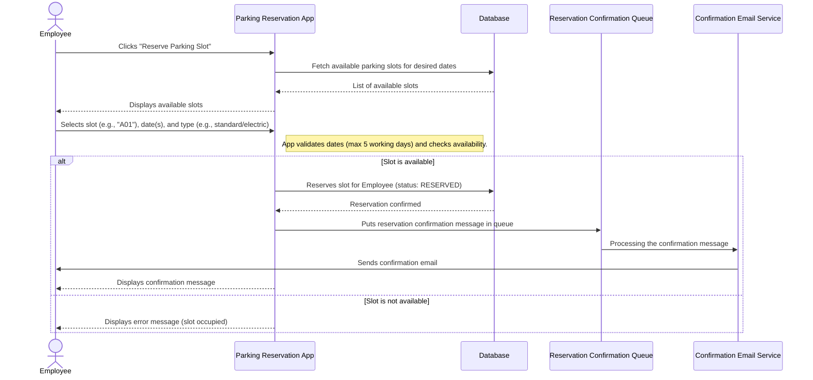

```mermaid
sequenceDiagram
    actor Employee
    participant App as Parking Reservation App
    participant DB as Database
    participant Queue as Reservation Confirmation Queue
    participant EmailService as Confirmation Email Service

    Employee->>App: Clicks "Reserve Parking Slot"
    App->>DB: Fetch available parking slots for desired dates
    DB-->>App: List of available slots
    App-->>Employee: Displays available slots

    Employee->>App: Selects slot (e.g., "A01"), date(s), and type (e.g., standard/electric)
    Note right of App: App validates dates (max 5 working days) and checks availability.

    alt Slot is available
        App->>DB: Reserves slot for Employee (status: RESERVED)
        DB-->>App: Reservation confirmed

        App->>Queue: Puts reservation confirmation message in queue
        Queue->>EmailService: Processing the confirmation message
        EmailService->>Employee: Sends confirmation email

        App-->>Employee: Displays confirmation message
    else Slot is not available
        App-->>Employee: Displays error message (slot occupied)
    end
```