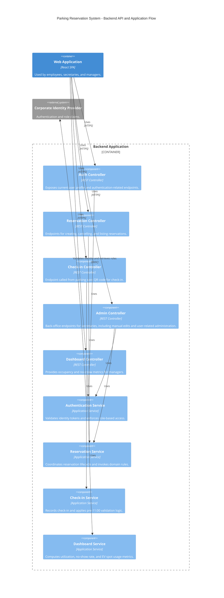
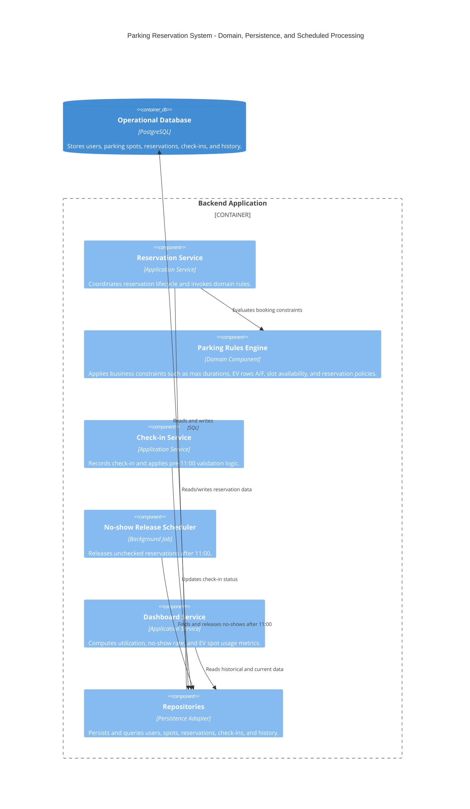
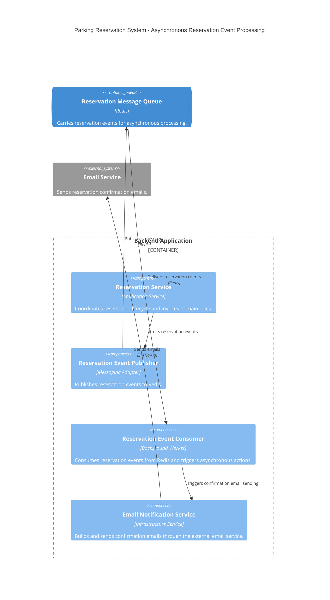

```mermaid
C4Component
    title Parking Reservation System - Backend API and Application Flow

    Container(webapp, "Web Application", "React SPA", "Used by employees, secretaries, and managers.")
    System_Ext(idp, "Corporate Identity Provider", "Authentication and role claims.")

    Container_Boundary(api, "Backend Application") {
        Component(authController, "Auth Controller", "REST Controller", "Exposes current user profile and authentication-related endpoints.")
        Component(reservationController, "Reservation Controller", "REST Controller", "Endpoints for creating, cancelling, and listing reservations.")
        Component(checkInController, "Check-in Controller", "REST Controller", "Endpoint called from parking spot QR code for check-in.")
        Component(adminController, "Admin Controller", "REST Controller", "Back-office endpoints for secretaries, including manual edits and user-related administration.")
        Component(dashboardController, "Dashboard Controller", "REST Controller", "Provides occupancy and no-show metrics for managers.")

        Component(authService, "Authentication Service", "Application Service", "Validates identity tokens and enforces role-based access.")
        Component(reservationService, "Reservation Service", "Application Service", "Coordinates reservation lifecycle and invokes domain rules.")
        Component(checkInService, "Check-in Service", "Application Service", "Records check-in and applies pre-11:00 validation logic.")
        Component(dashboardService, "Dashboard Service", "Application Service", "Computes utilization, no-show rate, and EV spot usage metrics.")
    }

    Rel(webapp, authController, "Uses", "HTTPS")
    Rel(webapp, reservationController, "Uses", "HTTPS")
    Rel(webapp, checkInController, "Uses", "HTTPS")
    Rel(webapp, adminController, "Uses", "HTTPS")
    Rel(webapp, dashboardController, "Uses", "HTTPS")

    Rel(authController, authService, "Uses")
    Rel(reservationController, reservationService, "Uses")
    Rel(checkInController, checkInService, "Uses")
    Rel(adminController, reservationService, "Uses")
    Rel(adminController, authService, "Uses")
    Rel(dashboardController, dashboardService, "Uses")

    Rel(authService, idp, "Validates identity and retrieves roles", "OIDC")

    UpdateLayoutConfig($c4ShapeInRow="5", $c4BoundaryInRow="1")
```

```mermaid
C4Component
    title Parking Reservation System - Domain, Persistence, and Scheduled Processing

    ContainerDb(db, "Operational Database", "PostgreSQL", "Stores users, parking spots, reservations, check-ins, and history.")

    Container_Boundary(api, "Backend Application") {
        Component(reservationService, "Reservation Service", "Application Service", "Coordinates reservation lifecycle and invokes domain rules.")
        Component(parkingRulesEngine, "Parking Rules Engine", "Domain Component", "Applies business constraints such as max durations, EV rows A/F, slot availability, and reservation policies.")
        Component(checkInService, "Check-in Service", "Application Service", "Records check-in and applies pre-11:00 validation logic.")
        Component(releaseScheduler, "No-show Release Scheduler", "Background Job", "Releases unchecked reservations after 11:00.")
        Component(dashboardService, "Dashboard Service", "Application Service", "Computes utilization, no-show rate, and EV spot usage metrics.")
        Component(repository, "Repositories", "Persistence Adapter", "Persists and queries users, spots, reservations, check-ins, and history.")
    }

    Rel(reservationService, parkingRulesEngine, "Evaluates booking constraints")
    Rel(reservationService, repository, "Reads/writes reservation data")
    Rel(checkInService, repository, "Updates check-in status")
    Rel(releaseScheduler, repository, "Finds and releases no-shows after 11:00")
    Rel(dashboardService, repository, "Reads historical and current data")
    Rel(repository, db, "Reads and writes", "SQL")

    UpdateLayoutConfig($c4ShapeInRow="3", $c4BoundaryInRow="1")
```

```mermaid
C4Component
    title Parking Reservation System - Asynchronous Reservation Event Processing
    ContainerQueue(queue, "Reservation Message Queue", "Redis", "Carries reservation events for asynchronous processing.")
    System_Ext(emailService, "Email Service", "Sends reservation confirmation emails.")

    Container_Boundary(api, "Backend Application") {
        Component(reservationService, "Reservation Service", "Application Service", "Coordinates reservation lifecycle and invokes domain rules.")
        Component(eventPublisher, "Reservation Event Publisher", "Messaging Adapter", "Publishes reservation events to Redis.")
        Component(eventConsumer, "Reservation Event Consumer", "Background Worker", "Consumes reservation events from Redis and triggers asynchronous actions.")
        Component(emailNotificationService, "Email Notification Service", "Infrastructure Service", "Builds and sends confirmation emails through the external email service.")
    }

    Rel(reservationService, eventPublisher, "Emits reservation events")
    Rel(eventPublisher, queue, "Publishes messages", "Redis")
    Rel(queue, eventConsumer, "Delivers reservation events", "Redis")
    Rel(eventConsumer, emailNotificationService, "Triggers confirmation email sending")
    Rel(emailNotificationService, emailService, "Sends emails", "SMTP/API")
    UpdateLayoutConfig($c4ShapeInRow="2", $c4BoundaryInRow="1")
```