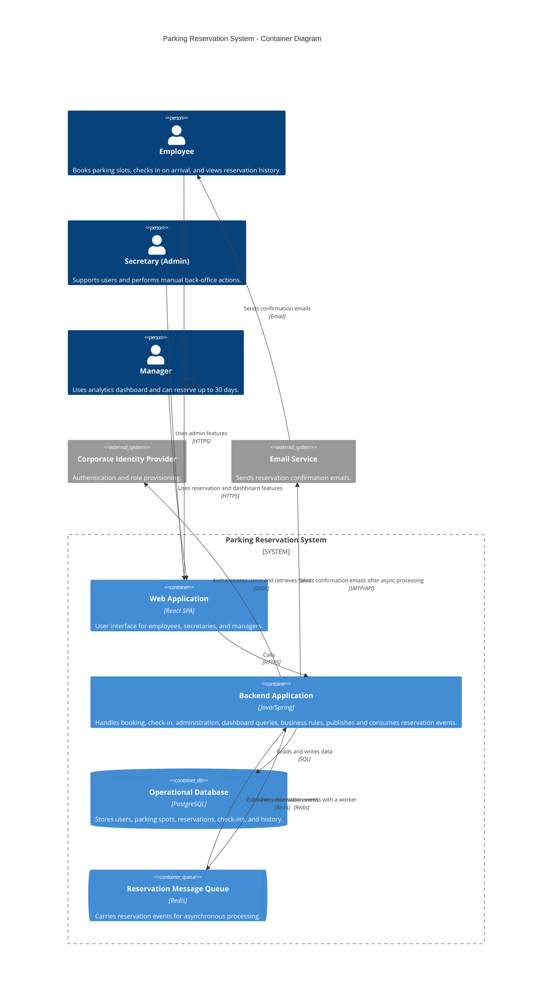

```mermaid
C4Container
    title Parking Reservation System - Container Diagram

    Person(employee, "Employee", "Books parking slots, checks in on arrival, and views reservation history.")
    Person(secretary, "Secretary (Admin)", "Supports users and performs manual back-office actions.")
    Person(manager, "Manager", "Uses analytics dashboard and can reserve up to 30 days.")

    System_Ext(idp, "Corporate Identity Provider", "Authentication and role provisioning.")
    System_Ext(emailService, "Email Service", "Sends reservation confirmation emails.")

    System_Boundary(parking_system, "Parking Reservation System") {
        Container(webapp, "Web Application", "React SPA", "User interface for employees, secretaries, and managers.")
        Container(api, "Backend Application", "Java/Spring", "Handles booking, check-in, administration, dashboard queries, business rules, publishes and consumes reservation events.")
        ContainerDb(operationalDb, "Operational Database", "PostgreSQL", "Stores users, parking spots, reservations, check-ins, and history.")
        ContainerQueue(messageQueue, "Reservation Message Queue", "Redis", "Carries reservation events for asynchronous processing.")
    }

    Rel(employee, webapp, "Uses", "HTTPS")
    Rel(secretary, webapp, "Uses admin features", "HTTPS")
    Rel(manager, webapp, "Uses reservation and dashboard features", "HTTPS")

    Rel(webapp, api, "Calls", "HTTPS")
    Rel(api, idp, "Authenticates users and retrieves roles", "OIDC")
    Rel(api, operationalDb, "Reads and writes data", "SQL")
    Rel(api, messageQueue, "Publishes reservation events", "Redis")
    Rel(messageQueue, api, "Consumes reservation events with a worker", "Redis")
    Rel(api, emailService, "Sends confirmation emails after async processing", "SMTP/API")
    Rel(emailService, employee, "Sends confirmation emails", "Email")

    UpdateLayoutConfig($c4ShapeInRow="3", $c4BoundaryInRow="1")
```