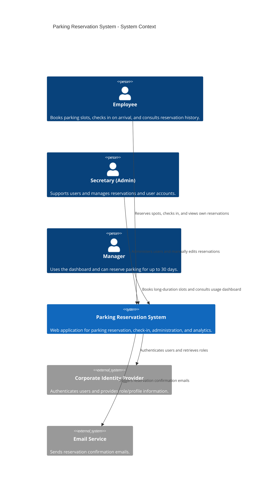

```mermaid
C4Context
    title Parking Reservation System - System Context

    Person(employee, "Employee", "Books parking slots, checks in on arrival, and consults reservation history.")
    Person(secretary, "Secretary (Admin)", "Supports users and manages reservations and user accounts.")
    Person(manager, "Manager", "Uses the dashboard and can reserve parking for up to 30 days.")

    System(parkingSystem, "Parking Reservation System", "Web application for parking reservation, check-in, administration, and analytics.")

    System_Ext(idp, "Corporate Identity Provider", "Authenticates users and provides role/profile information.")
    System_Ext(emailService, "Email Service", "Sends reservation confirmation emails.")

    Rel(employee, parkingSystem, "Reserves spots, checks in, and views own reservations")
    Rel(secretary, parkingSystem, "Administers users and manually edits reservations")
    Rel(manager, parkingSystem, "Books long-duration slots and consults usage dashboard")

    Rel(parkingSystem, idp, "Authenticates users and retrieves roles")
    Rel(parkingSystem, emailService, "Triggers reservation confirmation emails")

    UpdateLayoutConfig($c4ShapeInRow="3", $c4BoundaryInRow="1")
```